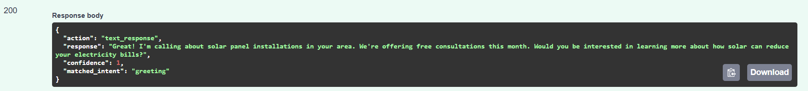

# VoiceBot NLU System

A real-time Natural Language Understanding (NLU) system for voice bot applications. This system processes transcribed user input and returns appropriate WAV filenames for audio playback in phone call scenarios.

Demo & Media


Initially I made it return responses like this:



🎥 Demo Video

Then I reconsidered the requirements by you and fixed it to return responses like you requested:

```markdown
[Click here to watch the final NLU demo](assets/WorkingNLU.mp4)
```


```

---

## System Setup & Usage

### Overview

The VoiceBot NLU system is designed for real-time voice bot applications that handle phone calls. It:

- Receives transcribed text input (audio processing handled separately)
- Matches user input to predefined intents using advanced semantic similarity
- Returns WAV filenames for audio responses
- Handles objections, fulfillments, and fallback scenarios
- Provides confidence scores for matched intents

### System Requirements

- **Operating System**: Windows 10/11, macOS, or Linux
- **Python**: Version 3.8 or higher
- **Memory**: Minimum 4GB RAM (8GB recommended)
- **Storage**: 500MB free space for dependencies

### Installation

#### 1. Clone or Download the Project

```bash
# If using Git
git clone <repository-url>
cd voice-bot

# Or download and extract the ZIP file
```

#### 2. Create Virtual Environment (Recommended)

```bash
# Create virtual environment
python -m venv .venv

# Activate virtual environment
# Windows:
.venv\Scripts\activate
# macOS/Linux:
source .venv/bin/activate
```

#### 3. Install Dependencies

```bash
# Install required packages
pip install -r requirements.txt

# Download spaCy language model
python -m spacy download en_core_web_md
```

#### 4. Verify Installation

```bash
# Check if all dependencies are installed
python -c "import spacy; print('spaCy:', spacy.__version__)"
python -c "import fastapi; print('FastAPI installed successfully')"
```

### Running the System

#### Start the Server

```bash
# Method 1: Using uvicorn directly
python -m uvicorn main:app --reload

# Method 2: Using the main.py file
python main.py

# The server will start on http://127.0.0.1:8000
```

#### Verify Server is Running

1. Open your browser and go to `http://127.0.0.1:8000`
2. You should see: `{"message": "VoiceBot NLU API is running"}`
3. Check the interactive documentation at `http://127.0.0.1:8000/docs`

### API Documentation

#### Endpoints

##### 1. Health Check

```
GET /health
```

Returns server status information.

##### 2. Root Endpoint

```
GET /
```

Returns basic API information.

##### 3. Intent Matching (Main Endpoint)

```
POST /match_intent
```

**Request Body:**

```json
{
  "prompt": "2sol",
  "text": "how expensive is it?"
}
```

**Response:**

```json
{
  "action": "wav_response",
  "say": "savings_with_solar.wav",
  "confidence": 0.9288079345226288,
  "matched_intent": "how much do people save with solar?"
}
```

#### Response Fields

- **action**: Action type (`wav_response`, `wav_response_hangup`, `live_transfer`, `hangup`)
- **say**: WAV filename to play (empty string for hangup actions)
- **confidence**: Confidence score (0.0 to 1.0)
- **matched\_intent**: Matched intent text for debugging

### Sample Usage

#### Using cURL

```bash
# Test price question
curl -X POST http://127.0.0.1:8000/match_intent \
  -H "Content-Type: application/json" \
  -d '{"prompt": "2sol", "text": "how expensive is it?"}'

# Test greeting
curl -X POST http://127.0.0.1:8000/match_intent \
  -H "Content-Type: application/json" \
  -d '{"prompt": "1sol", "text": "yes i can hear you"}'

# Test objection
curl -X POST http://127.0.0.1:8000/match_intent \
  -H "Content-Type: application/json" \
  -d '{"prompt": "2sol", "text": "i'\''m on the TPS list"}'
```

#### Using Python

```python
import requests

# Test the API
response = requests.post(
    "http://127.0.0.1:8000/match_intent",
    json={"prompt": "2sol", "text": "how expensive is it?"}
)

result = response.json()
print(f"Action: {result['action']}")
print(f"WAV file: {result['say']}")
print(f"Confidence: {result['confidence']}")
```

### Testing

#### Automated Testing

Run the provided test script to verify the system:

```bash
# Run comprehensive tests
python test_wav_responses.py
```

The test script will:

- Verify server health
- Test various input scenarios
- Validate response format
- Check confidence scores

#### Manual Testing

Use the interactive documentation:

1. Go to `http://127.0.0.1:8000/docs`
2. Click "Try it out" on the `/match_intent` endpoint
3. Enter test data and execute

#### Test Cases

| Test Case      | Prompt | Input Text                  | Expected Action       | Expected WAV              |
| -------------- | ------ | --------------------------- | --------------------- | ------------------------- |
| Price Question | 2sol   | "how expensive is it?"      | wav\_response         | savings\_with\_solar.wav  |
| Greeting       | 1sol   | "yes i can hear you"        | wav\_response         | 1sol.wav                  |
| TPS Objection  | 2sol   | "i'm on the TPS list"       | wav\_response\_hangup | NI\_endCall.wav           |
| Voicemail      | 1sol   | "Welcome to BT voicemail"   | wav\_response\_hangup | ""                        |
| Solar Type     | 2sol   | "what type of solar is it?" | wav\_response         | what\_type\_of\_solar.wav |

### Configuration

#### Intent Configuration

The system uses `intent.json` for intent definitions. This file contains:

- **Prompts**: Different conversation stages (start, 1sol, 2sol, etc.)
- **Fulfil**: Positive responses that move the conversation forward
- **Objections**: Negative responses or concerns
- **Fallbacks**: Default responses when no good match is found

#### Similarity Thresholds

Key configuration constants in `matcher.py`:

- `OBJECTION_THRESHOLD = 0.7`: Minimum score for objection matching
- `FULFIL_THRESHOLD = 0.3`: Minimum score for fulfillment matching

#### Matching Algorithm

The system uses a hybrid approach:

- **Keyword matching (70% weight)**: Exact phrase and category matching
- **Semantic similarity (30% weight)**: spaCy-based semantic understanding

### File Structure

```
voice-bot/
├── main.py                 # FastAPI application
├── matcher.py              # Intent matching logic
├── intent.json             # Intent definitions (2838 lines)
├── requirements.txt        # Python dependencies
├── test_wav_responses.py   # Test script
├── .gitignore              # Git ignore rules
└── README.md               # This file
```

### Troubleshooting

#### Common Issues

1. **"Could not load spaCy model" error**

   ```bash
   python -m spacy download en_core_web_md
   ```

2. **"Port already in use" error**

   ```bash
   # Use different port
   python -m uvicorn main:app --reload --port 8001
   ```

3. **"intent.json file not found" error**

   - Ensure `intent.json` is in the project root directory
   - Check file permissions

4. **Low confidence scores**

   - Review intent definitions in `intent.json`
   - Adjust similarity thresholds in `matcher.py`

#### Performance Optimization

- The system loads spaCy model once at startup
- Intent matching uses efficient similarity algorithms
- Confidence scoring provides match quality feedback

#### Logging

The system provides detailed logging:

- Server startup and health information
- Intent matching results with confidence scores
- Error messages for troubleshooting

### Development

#### Adding New Intents

1. Edit `intent.json` to add new intents
2. Follow the existing structure for consistency
3. Test new intents using the test script

#### Modifying Similarity Logic

1. Edit `matcher.py` to adjust matching algorithms
2. Modify keyword groups for better accuracy
3. Adjust threshold values as needed

### Support

For technical issues:

1. Check the server logs for error messages
2. Verify all dependencies are installed correctly
3. Test with the provided test script
4. Review the interactive API documentation

### License

This project is proprietary software developed for voice bot applications.

